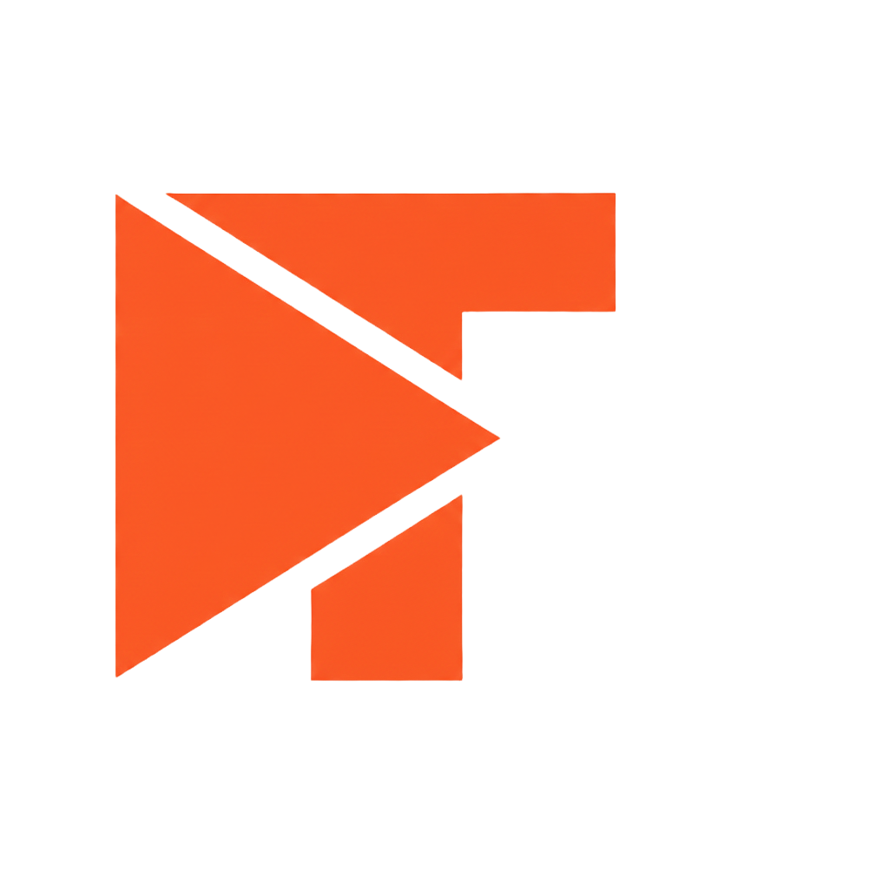

<p align="center">
  
</p>

# Tegenett Unraid Plugins

Personal Unraid 7.x plugins by Tegenett. **ATP** = A Tegenett Plugin.

## Available Plugins

| Plugin | Icon | Description | Status |
|--------|:----:|-------------|--------|
| [ATP Backup](atp_backup/) |  | Smart backup with local/remote SMB, WOL, Discord notifications | ✅ Active |
| [ATP Emby Smart Cache](atp_emby_smart_cache/) |  | Intelligent media caching for Emby | ✅ Active |

## Installation

In Unraid: **Plugins** → **Install Plugin** → paste URL:

### ATP Backup
```
https://raw.githubusercontent.com/gitstabs/tegenett-unraid-plugins/main/atp_backup/atp_backup.plg
```

**Features:**
- Local and remote SMB backups (rsync-based)
- Wake-on-LAN with auto-shutdown
- Discord notifications (start/success/failure + daily summary)
- Retry on failure
- Pre/post backup scripts
- Backup health dashboard

### ATP Emby Smart Cache
```
https://raw.githubusercontent.com/gitstabs/tegenett-unraid-plugins/main/atp_emby_smart_cache/atp_emby_smart_cache.plg
```

**Features:**
- Automatic caching of actively watched media to SSD/NVMe
- Pre-cache next episodes for seamless binge-watching
- Bandwidth limiting and space management
- Discord notifications
- SQLite state tracking

## Requirements

- Unraid 7.0.0 or newer
- For remote SMB backups: Unassigned Devices plugin
- For Emby Smart Cache: Emby Media Server with API access

## Support

Issues: https://github.com/gitstabs/tegenett-unraid-plugins/issues

## License

These plugins are provided as-is for personal use.
